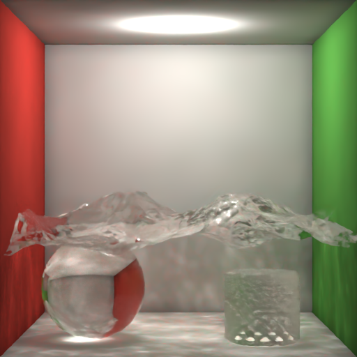

# OptiX Photon Mapping Cornell Box

This repository contains a Cornell-box-based photon mapping renderer built with NVIDIA OptiX and CUDA.
The implementation is inspired by the JCGT paper [Accelerating Photon Mapping for Hardware-Based Ray Tracing](https://jcgt.org/published/0012/01/01/): instead of using a CPU-side photon lookup structure, photons are turned into OptiX-traceable primitives so the gather step can run on the ray tracing pipeline itself.

This is not a line-by-line reproduction of the paper. It is a compact OptiX-focused implementation that applies the same general idea to a Cornell Box test scene and extends it with a few practical controls for debugging caustics and indirect lighting.

## Current Scene

The current scene is a Cornell Box variant with:

- Diffuse Cornell Box walls
- One diffuse short box
- One refractive glass sphere
- One refractive water mesh loaded from `models/Mesh001.ply`
- One imported refractive mesh loaded from `models/mesh_00001.ply`
- A spherical light by default, with optional quad or point light modes

The scene is set up to make refractive paths and caustics easy to inspect.



## Rendering Approach

The renderer is organized as follows:

- Scene geometry is built as a triangle GAS.
- A light tracing pass emits photons and stores them in GPU arrays.
- Stored photons are split into global and caustic sets.
- Each stored photon is converted into a small AABB-backed custom primitive.
- Separate photon GAS objects are built for the global and caustic photon sets.
- The camera pass launches short gather rays into those photon GAS objects and accumulates nearby photons.
- Optional progressive iterations and the OptiX denoiser can be applied to the beauty output.

This gives the project the "OptiX-based photon gather" character you asked for, and it is the part most directly aligned with the JCGT reference.

## Requirements

- Linux with an NVIDIA GPU and recent driver
- CUDA Toolkit
- NVIDIA OptiX SDK 9.0
- `make` and a C++17 compiler
- For Docker execution: Docker, Docker Compose, and NVIDIA Container Toolkit

By default the `Makefile` expects the OptiX SDK here:

```text
./NVIDIA-OptiX-SDK-9.0.0-linux64-x86_64
```

If your SDK is elsewhere, override `OPTIX_ROOT` when building.

## Build

Fetch the external PLY assets first:

```bash
make prepare
```

This downloads:

- `models/Mesh001.ply`
- `models/mesh_00001.ply`

Then build:

```bash
make
```

Artifacts:

- `build/example_app_optix`
- `build/renderer.ptx`

## Run Locally

```bash
./build/example_app_optix output.ppm [width] [height] [spp] [photon_count] [render_mode] [photon_radius] [indirect_scale] [photon_bounces] [photon_normal_reject_cos] [ppm_iterations] [ppm_alpha] [debug_stats] [photon_eval_mode] [direct_light_samples] [enable_denoiser] [light_radius] [global_photon_rejection] [multi_diffuse_caustic_map] [light_intensity]
```

If `output.ppm` is a relative path, the image is written under `images/` by default. Set `OUTPUT_DIR` to change that base directory.

### Command Line Arguments

| Argument | Default | Meaning |
| --- | ---: | --- |
| `output.ppm` | `cornell.ppm` | Output filename |
| `width` | `800` | Image width |
| `height` | `800` | Image height |
| `spp` | `8` | Camera samples per pixel |
| `photon_count` | `60000` | Number of emitted photons; `0` disables photon mapping |
| `render_mode` | `0` | Output mode |
| `photon_radius` | `35` | Global photon gather radius |
| `indirect_scale` | `1.0` | Indirect lighting multiplier |
| `photon_bounces` | `10` | Maximum path depth for photon and camera paths |
| `photon_normal_reject_cos` | `0.9` | Face-normal rejection threshold; `0` disables it |
| `ppm_iterations` | `1` | Progressive photon mapping iterations |
| `ppm_alpha` | `0.7` | Progressive radius update parameter |
| `debug_stats` | `0` | Print photon statistics to the log |
| `photon_eval_mode` | `0` | `0 = stochastic`, `1 = full` |
| `direct_light_samples` | `1` | Direct lighting samples per shading point |
| `enable_denoiser` | `0` | Apply the OptiX denoiser to beauty output |
| `light_radius` | `20` | Radius of the spherical light |
| `global_photon_rejection` | `0.3` | Probability of storing a global photon |
| `multi_diffuse_caustic_map` | `0` | Keep caustic chains after diffuse events |
| `light_intensity` | `50.0` | Light intensity; can also be set with `LIGHT_INTENSITY` |

### Render Modes

| Value | Mode |
| ---: | --- |
| `0` | Beauty |
| `1` | Photon gather count visualization |
| `2` | Indirect only |
| `3` | Direct only |
| `4` | Caustic only |

### Example

```bash
./build/example_app_optix cornell.ppm 512 512 4 300000 0 45 1.0 10 0.9 4 0.7 0 0 4 1 5 0.3 0 50.0
```

## Docker

The repository includes a Docker workflow for building and rendering inside an NVIDIA CUDA container.

### Docker Prerequisites

- `NVIDIA-OptiX-SDK-9.0.0-linux64-x86_64` must exist at the repository root as an unpacked directory
- NVIDIA Container Toolkit must be installed on the host

### Default Docker Run

```bash
docker compose run --rm optix-dev
```

This runs `make prepare all` inside the container, then uses the lightweight preset from `entrypoint.sh` and writes:

- `images/cornell_photon.png`

Internally, the script renders a PPM first and converts it to PNG with ImageMagick.

### Render Additional Variants

```bash
docker compose run --rm -e RENDER_VARIANTS=1 optix-dev
```

This also generates:

- `images/cornell_direct.png`
- `images/cornell_photon_debug.png`
- `images/cornell_photon_indirect.png`
- `images/cornell_caustic.png`

### Main Environment Variables

`entrypoint.sh` forwards the following controls to the renderer:

- `WIDTH`
- `HEIGHT`
- `SPP`
- `PHOTON_COUNT`
- `PHOTON_RADIUS`
- `INDIRECT_SCALE`
- `PHOTON_BOUNCES`
- `PHOTON_NORMAL_REJECT_COS`
- `GLOBAL_PHOTON_REJECTION`
- `MULTI_DIFFUSE_CAUSTIC_MAP`
- `PPM_ITERATIONS`
- `PPM_ALPHA`
- `PHOTON_EVAL_MODE`
- `DIRECT_LIGHT_SAMPLES`
- `ENABLE_DENOISER`
- `LIGHT_RADIUS`
- `LIGHT_INTENSITY`
- `LIGHT_TYPE` (`0 = sphere`, `1 = quad`, `2 = point`)
- `POINT_POWER_REFERENCE_RADIUS`
- `DEBUG_STATS`
- `RENDER_VARIANTS`
- `OUTPUT_DIR`

### Example Docker Run

```bash
docker compose run --rm \
  -e PHOTON_COUNT=300000 \
  -e PHOTON_RADIUS=45 \
  -e INDIRECT_SCALE=1.0 \
  -e PHOTON_BOUNCES=10 \
  -e PHOTON_NORMAL_REJECT_COS=0.9 \
  -e DIRECT_LIGHT_SAMPLES=4 \
  -e ENABLE_DENOISER=1 \
  -e LIGHT_RADIUS=5 \
  -e LIGHT_INTENSITY=50.0 \
  optix-dev
```

For a heavier point-light caustic run, see `run.sh`.

## Debugging and Tuning

- If `cornell_photon_debug.png` is mostly dark blue, the gather radius is probably too small or too few photons are reaching the surface.
- Increase `PHOTON_COUNT` to reduce blotchy indirect lighting.
- Increase `PHOTON_RADIUS` to stabilize the gather estimate, then lower it again to recover sharp caustics.
- Lower `LIGHT_RADIUS` or use `LIGHT_TYPE=2` for sharper point-light caustics.
- Increase `DIRECT_LIGHT_SAMPLES` or `SPP` if direct lighting is noisy.
- Enable `DEBUG_STATS=1` to inspect photon counts and build statistics in the log.

## Asset Attribution

- `models/Mesh001.ply` was taken from the `water-caustic` scene in SirKero's `RTProgressivePhotonMapper` repository (Licensed under BSD 3-Clause):
  <https://github.com/SirKero/RTProgressivePhotonMapper/blob/master/Scenes/water-caustic/models/Mesh001.ply>
- `models/mesh_00001.ply` was taken from the `caustic-glass` scene in SirKero's `RTProgressivePhotonMapper` repository (Licensed under BSD 3-Clause):
  <https://github.com/SirKero/RTProgressivePhotonMapper/blob/master/Scenes/caustic-glass/geometry/mesh_00001.ply>

## Reference

- JCGT paper: [Accelerating Photon Mapping for Hardware-Based Ray Tracing](https://jcgt.org/published/0012/01/01/)

That paper is the conceptual reference for the OptiX-based photon gather structure used here.
